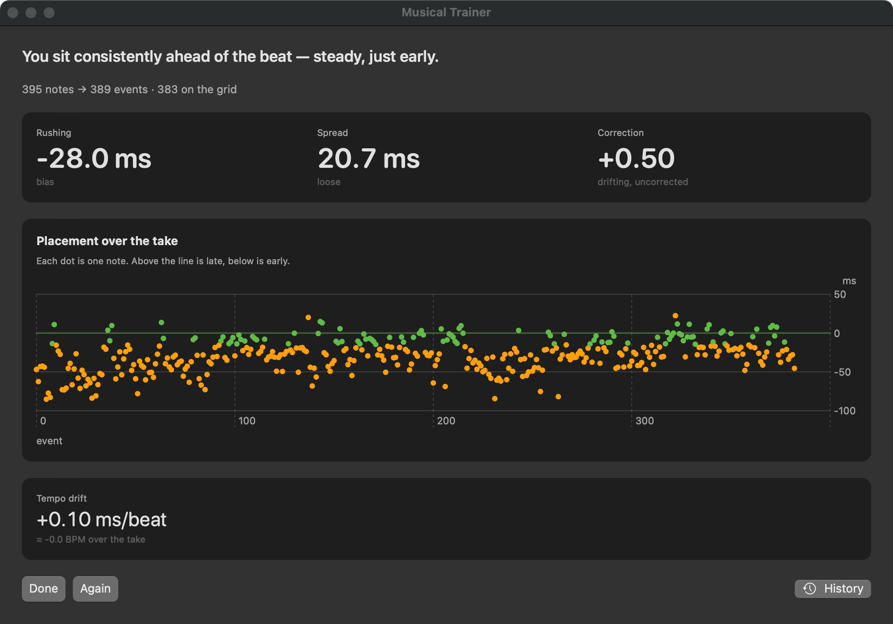
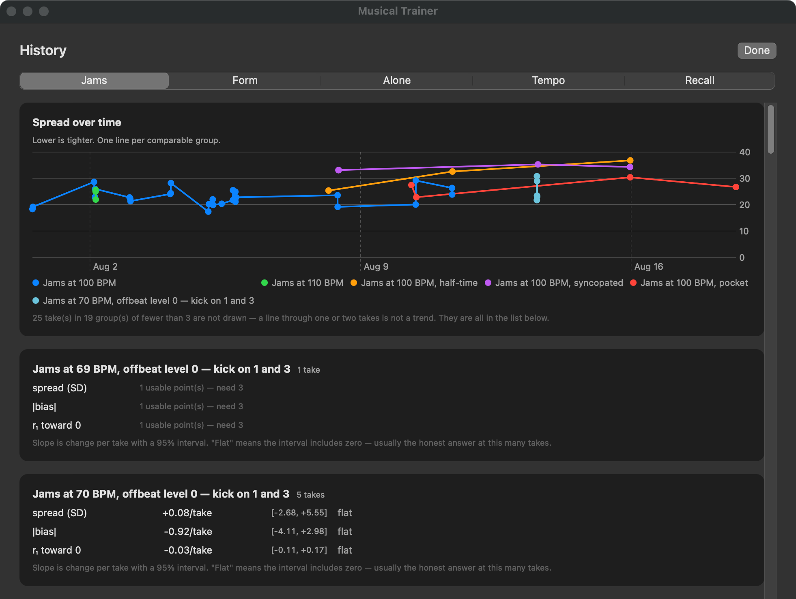

# Musical Trainer

A macOS app that measures musical timing from a MIDI keyboard and trains it. It plays a synthesized
backing band, records every note you play against it with sub-millisecond timestamps, and tells you
things you can't hear yourself: whether you rush or drag, how consistent you are, whether the tempo
drifts, and whether the instability is in your internal clock or in your hands.

**Claude Code wrote the code in this repository, under my direction,** in July and August 2026.
[How it was built](#how-it-was-built) says exactly which parts are mine.



It exists because I needed it. I've played guitar for 25 years and I'm learning keys, and timing is
the thing I can't self-diagnose. It is a personal tool with one user, not a product. Nothing is
shown while you play: you rate how a take felt, and only then see the numbers.

## How it was built

Claude Code (Anthropic's coding agent) wrote the code and most of the documentation. My part:

- **Direction.** What to measure and why, which drills exist, what counts as done. Every milestone
  in [PLAN.md](PLAN.md) was accepted or sent back by me.
- **The ground truth.** I played every recorded take, and every "does this drum kit sound like its
  name?" verdict is my ear. The code will not put a style into rotation until I have approved it.
- **The rules the agent works under.** I set them; the agent wrote them down in
  [STANDARDS.md](STANDARDS.md) and [AGENT.md](AGENT.md), and I approved each change. The agent
  cannot commit or push ([`.claude/settings.json`](.claude/settings.json)); every commit is one I
  made and signed, and I have reviewed and merged more than 80 pull requests.
- **The pipeline.** The repository is developed on my self-hosted Gitea, with CI on a self-hosted
  Woodpecker instance. GitHub is a push mirror, and GitHub Actions runs the same gate here.

What made a fast, AI-written codebase trustworthy was the verification around it, more than the
Swift itself:

- **One gate, run before every commit** ([`scripts/check.sh`](scripts/check.sh)). It checks
  architecture boundaries, real-time audio rules, zero dependencies and no force-unwraps, and that
  the test counts and module sizes quoted in the docs match the code.
- **A gate that has itself been tested.** In August, with 22 static rules, a violation of every one
  was planted at once and two stayed green. The fixes made the dependency rule able to fail, and
  made a rule that cannot run (a renamed file, a bad pattern) fail instead of passing.
- **Architecture enforced by the compiler.** The analysis modules must not touch audio or MIDI. CI
  builds them on Linux, where those frameworks don't exist, so a violation fails the build.
- **Tests against known answers.** The analysis is tested on synthetic players whose timing is
  known in advance, so a test checks that the analysis recovers what was put in. 926 cases in all.
- **A catalogue of our mistakes.** [LESSONS.md](LESSONS.md) lists 22 recurring failure patterns
  this project produced, each with a real instance and the guard added against it.

The commit history is the record, including how it started. The first thirteen commits predate
this process: most are named for the milestone they delivered, `M0` to `M11`, and are as large as
that suggests. From the commit that added the gate on 4 August, every commit I authored follows a
conventional-commit format that a hook enforces, and nearly all carry a `Refs:` line pointing at the
section they implement. Every authored commit is signed; the merge commits are Gitea's and are not.

## What it does

- **Seven modes.** *Jam* (play along), *Offbeat* (hold the ska/reggae chop as the downbeat drops
  out), *Form* (mark phrase boundaries without counting), *Alone* (keep time through silence),
  *Tempo* (produce a tempo unaccompanied), *Recall* (hear a tempo, lose it, get it back), and
  *Play* (just the band, nothing measured).
- **Measurement.** Bias, spread and drift per take. A Wing–Kristofferson split of clock variance vs
  motor variance. Bootstrap confidence intervals, resampled in blocks within a take and by take
  across takes, so correlated timing data is not treated as independent.
- **Session planning.** Pick 20, 30 or 45 minutes and the app builds the evening's drills from what
  your recent takes measured, and says why it chose each one.
- **Difficulty ladders instead of sliders.** Subdivision (quarters → sixteenths), swing, offbeat
  level, form level and phrase length. A rung is earned on the skill it tests.
- **Preregistered experiments.** A/B comparisons with arms assigned before you play and no verdict
  before the declared sample size.
- **Synthesized band.** Drums, cymbals, bass and organ, all synthesized (no samples), with four
  generated styles built from a seed so a piece can be replayed. See [The band](#the-band).
- **Latency calibration.** A chirp-loopback procedure through the built-in mic, stored per output
  device. See [Calibration](#calibration).
- **Local only.** No network access (the gate enforces it). Data lives in
  `~/Library/Application Support/MusicalTrainer/`, one JSON file per take, and every analysis is
  recomputed from the raw note timings.



## The band

Jam and Play can pick a **band**: a generated backing built from a style and a seed, so no two
evenings play the same piece. The seed is stored with the take, so a piece you liked can be asked
for again.

A style is **steps and a kit**, not steps alone. There are four, and each carries its own tuning of
the drums rather than sharing one general-purpose set, because a genre name that only describes the
pattern is a claim the sound does not keep:

| Style | The feel | The kit |
|---|---|---|
| `driving` | Straight eighths, hat-led | Close-miked and forward. Snaps rather than rings, tight hats, the driest of the four |
| `pocket` | Sits back, clap on the backbeat, walking bass | Warm, fat and roomy. Body rather than crack |
| `syncopated` | Off-beat kick, ghost snares, sixteenths on the hat | High, tight and dry, so the ghost notes read |
| `half-time` | One snare on beat three, and a great deal of air | Deep, long and wet. Each hit fills the space it is given |

The kit follows the style; there is no separate picker.

**Every sound is synthesized. There are no samples anywhere in the repository.** Thirteen drum and
percussion voices, a bass and an organ are all generated in code. The drums have velocity layers,
round-robin variation so no two hits are identical, and a room. The cymbals are modelled as struck
plates: 60 to 130 inharmonic modes each, with the high modes dying faster so the sound darkens as it
rings, and a crash that blooms just after the strike the way a hard-hit plate does. Every take
records **which kit it heard**, and takes played over different kits are never pooled into one
trend, because changing the kit changes the task.

**Whether a style sounds like its own name is decided by my ear, not by a test.** `render` writes
WAVs to listen to, and a style I have not approved is kept out of the rotation. It is a real gate.
Three of the original four styles were renamed after a listening pass, because the name promised
what the kit could not deliver, and the kits were retuned on verdicts like *"not quite ghosty
enough"* (the syncopated snare's wires came up) and *"washy"* (half-time's room was pulled back).

**All four are withdrawn right now.** Every style has been heard, but the drum synthesis was rebuilt
under them and the rebuild isn't finished, and changing the kit withdraws every standing verdict.
Until the next listening pass, a jam over a generated band needs `--probe` on the command line, and
neither the app nor the session planner will offer one.

## What it does not do

- **It needs a MIDI keyboard.** Computer-keyboard input and guitar input are planned but not built.
  It has only been tested with a Novation Launchkey Mini MK2.
- **The generated band is withdrawn for now.** The drum-synthesis rebuild is unfinished, so all four
  styles are out of rotation until the next listening pass ([The band](#the-band)). The CLI can
  still play them with `--probe`.
- **Mac only**, wired audio only. Bluetooth output is refused because its latency varies too much to
  calibrate.
- **No CI coverage for the macOS half.** CI builds and tests the two platform-independent modules
  (593 of the 926 tests). The app, the audio/MIDI layer and the CLI are built and tested only by the
  local pre-commit hook.
- **No binary release.** Build from source.

## Stack

Swift 5.7 (Swift Package Manager, no Xcode project) · SwiftUI · Swift Charts · AVAudioEngine ·
CoreMIDI · CoreAudio · XCTest · Bash · Woodpecker CI and GitHub Actions · Gitea. Zero third-party
dependencies.

## Running it

**Requirements:** macOS 13+, Xcode 14+ (or a Swift 5.7+ toolchain), a USB MIDI keyboard, and wired
headphones or speakers.

```sh
git clone https://github.com/HeftyB/Musical-Trainer.git
cd Musical-Trainer

swift test                        # 926 tests on macOS
./build-app.sh                    # builds and ad-hoc signs "Musical Trainer.app"
open "Musical Trainer.app"
```

The command-line tool does everything the app does, plus calibration and diagnostics:

```sh
swift build -c release
./.build/release/TimingSpike selftest          # verifies the analysis pipeline end to end
```

Calibrate before your first take ([Calibration](#calibration)). See [docs/cli.md](docs/cli.md) for
every command.

**On Linux**, `swift test` builds and runs the two pure modules: the half of the project CI checks.

## Calibration

Do this once before your first take.

The quantity that matters is `L_midi + L_out`, MIDI transport latency plus output latency, because
asynchrony reduces to `(midiHostTime − clickEmitHostTime) − (L_midi + L_out)`. The two-path
procedure measures that sum directly, so the two terms never need separating.

A full run takes about two minutes of playing, which is too much to repeat for every pair of
headphones. Since `L_midi` belongs to the keyboard rather than the output device, one full run
establishes a reference and any other device needs only a 15-second loopback:

```
C(dev) = C(ref) + (RT(dev) − RT(ref)) + air(ref) − air(dev)
```

```sh
# Once, on internal speakers: the microphone hears both the chirp and the key strike.
./.build/release/TimingSpike calibrate

# Then for headphones: rest one earcup against the built-in microphone.
./.build/release/TimingSpike calibrate quick

./.build/release/TimingSpike show
```

Stored at `~/Library/Application Support/MusicalTrainer/calibration.json`. Devices are keyed by name
**and data source**, because on a MacBook the internal speakers and the headphone jack are the same
CoreAudio device with very different latency, so switching the physical output selects the right
constant automatically.

**Absolute accuracy matters less than it looks.** A constant offset shifts measured *bias* and
leaves *spread* untouched, and spread is the skill metric. An uncalibrated take still measures
spread and drift correctly; it flags the bias as unreliable.

### Before any live run

- **Microphone access.** Grant it to your terminal under System Settings → Privacy & Security →
  Microphone. Command-line tools inherit the terminal's permission.
- **No Bluetooth.** The tool refuses to run on it: its latency varies run to run and cannot be
  calibrated away.
- **Microphone roughly equidistant** from the sound source and the keyboard during two-path runs,
  so the acoustic path lengths cancel.

## Status

A working personal tool. I practiced with it through August 2026, paused there, and plan to return
to both the practice and the development. The measurement, drills, planner, experiment runner and
synthesized band all work. Unfinished: the drum-synthesis rework (and, blocked behind it,
re-approving the four band styles), and replacing the four per-drill difficulty rules with one
model. Not started: drum-pad mode, guitar and voice input, harmony. [PLAN.md](PLAN.md) §7 has the
full milestone table.

## Repository map

| | |
|---|---|
| `Sources/TimingCore` | Pure timing analysis and the session planner. No audio, no MIDI; builds anywhere |
| `Sources/GrooveCore` | Pure pattern and style generation. Depends on nothing |
| `Sources/TrainerKit` | Audio engine, MIDI capture, synthesis, calibration, storage, drill runners (macOS) |
| `Sources/MusicalTrainerApp` | The SwiftUI app |
| `Sources/TimingSpike` | The CLI |
| `Tests/` | 926 XCTest cases; the shared synthetic-player generators are in `Tests/TestSupport` |
| `scripts/` | The gate, hook installer, PR and release scripts |
| `.woodpecker/`, `.github/workflows/` | CI: Woodpecker on the forge, and the same gate on GitHub Actions |
| [PLAN.md](PLAN.md) | Design, metrics, milestone status |
| [STANDARDS.md](STANDARDS.md) / [AGENT.md](AGENT.md) | Engineering rules / the agent's operating manual |
| [LESSONS.md](LESSONS.md) | Failure patterns and their guards |
| [docs/JOURNAL.md](docs/JOURNAL.md) | Build journal: every milestone, practice session and review |

## License

Copyright (C) 2026 Andrew W. Shields. Licensed under the GNU General Public License, version 3 or
(at your option) any later version (GPL-3.0-or-later). See [LICENSE](LICENSE).
